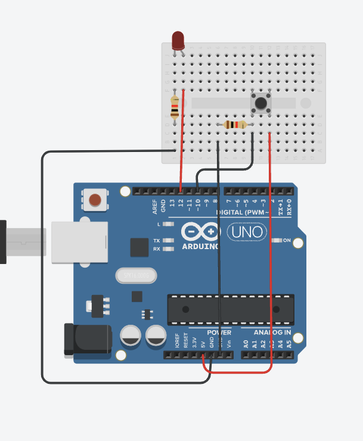
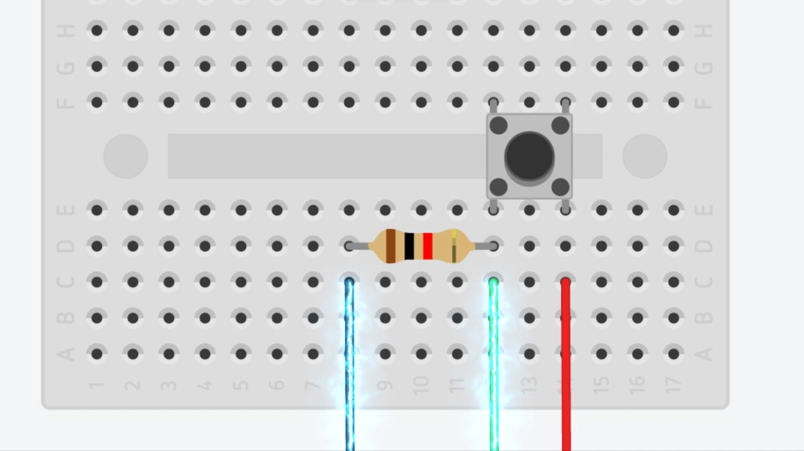
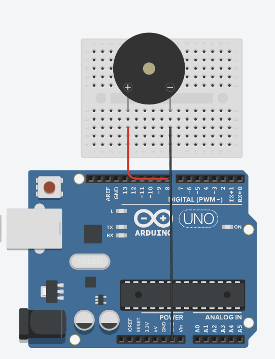

## 普通物理學實驗報告
### 組別A-1
### 組員:龔裕棠、賴威廷、賴庭岳
<style>
    td, th {
        border: none!important;
    }
    h2{
        font-size:120px;
        text-align: center;
        color: rgb(60, 112,198);
        
    }
    h3{
        font-size:50px;
        text-align: center;
        
    }

</style>

---
# 大綱
1. 實驗一 簡單的LED電路
2. 實驗二 按鈕測試電路
3. 實驗三 揚聲器電路
4. 實驗四 設計反應計時器
<style>
    h1{
        font-size:100px;
        text-align: left;
    }
    section{
        font-size:50px;
    }
    h4{
        font-size:80px;
    }

</style>
---
# 實驗一<br>簡單LED電路
利用單獨arduino單獨控制一顆LED閃爍十次


---
#### 程式碼
```arduino
int LED =12;//輸出的pin位
void setup() {
  Serial.begin(9600);
  pinMode(LED,OUTPUT);//設定輸出
}
void loop(){
    for(int i=0;i<10;i++){
        digitalWrite(LED,1);
        delay(100);
        digitalWrite(LED,0);
        delay(100);
        Serial.println(i,DEC);//輸出現在是第幾次閃
    }
    Serial.println("ALL DONE!!");
    Serial.println("全部完成!!");
```
<!-- _backgroundColor: bla -->

---
# 實驗二<br>按鈕電路
利用arduino和按鈕一顆LED閃爍十次



---
#### 程式碼

```arduino
int button=10;//輸入的pin位
int LED =12;//輸出的pin位
void setup() {
    Serial.begin(9600);
    pinMode(button,INPUT);//設定輸入
    pinMode(LED,OUTPUT);//設定輸出
}
void loop() {
    Serial.println(digitalRead(10));//輸出現在按鈕的狀態
    delay(100);
    if(digitalRead(10)==1){//如果按鈕被按下
        //LED閃一下
        digitalWrite(LED,1);
        delay(100);
        digitalWrite(LED,0);
        delay(100); 
    }
}
```

---

# 按鈕為什麼要加電阻？？

---


---


---


---


---
# 實驗三<br>揚聲器電路
利用arduino控制揚聲器


---

```arduino
int sb=8;
int a[4]={2800,2400,4200,2000};
int b[4]={100,200,140,30};
void speak(int x,int y,bool z){
    tone(sb,x);//蜂鳴器發出聲音
    delay(y);//等待y毫秒
    noTone(sb);//讓蜂鳴器不要發出聲音
    if(z==true)delay(y);
}//蜂鳴器的副函式
void cur(int deep){
    if(deep==4)return;//停止遞迴
    speak(a[deep],b[deep],false);//蜂鳴器的副函式
    cur(deep+1);//進入下一層遞迴
    return;
}//遞迴計次法
void setup(){
    Serial.begin(9600);
    pinMode(sb,OUTPUT);
}

```
---
```arduino
void loop(){
    Serial.print("ALARM\n");
    Serial.print("警報器\n");
    for(int i=0;i<4;i++)speak(1500,500,true);//蜂鳴器的副函式
    Serial.print("robot replay\n");
    Serial.print("重播聲\n");
    delay(100);
    cur(0);//進入遞迴
    Serial.print("HYperspace\n");
    Serial.print("超空間\n");
    for(int d=15;d>=1;d--){
        for(int f=2000;f<=2500;f+=20){
            speak(f,d,false);//蜂鳴器的副函式
        }
    }
    Serial.print("done\n");
    Serial.print("完成\n");
    while(true);
}
```

---
# 副程式簡化
利用副程式來簡化原本很長的程式碼
```arduino 
tone(SP_PIN,1500);delay(500);noTone(SP_PIN);delay(500);

void speak(int x;int y) {
  tone(SP_PIN,x);delay(y);noTone(SP_PIN);delay(y);
}
speak(1500,500);

```
---

# 善用迴圈
就算利用了副程式，我們發現有很多地方會重覆使用要寫很多次所以我們使用迴圈
```arduino 
speak(1500,500);
speak(1500,500);
speak(1500,500);
speak(1500,500);
//上面四行等於下面一行
for(int i=0;i<4;i++)speak(1500,500);

```

---

# 善用陣列

就算用了迴圈跟副程式我們又使用了陣列
```arduino 
speak(2800,100);
speak(2400,200);
speak(4200,140);
speak(2000,30);
//上面四行等於下面三行
int a[4]={2800,2400,4200,2000};
int b[4]={100,200,140,30};
for(int i=0;i<4;i++)speak(a[i],b[i]);

```
---

# 除了迴圈的計次方法
```arduino 
void cur(int deep){
    if(deep==4)return;//停止遞迴
    speak(a[deep],b[deep]);//蜂鳴器的副函式
    cur(deep+1);//進入下一層遞迴
    return;
}//遞迴計次法

cur(0);//進入遞迴
```
---
# 實驗四<br>反應計時器
使用arduino製作的反應測試小遊戲


---
# 防止用背秒數的方式作弊
為了避免玩家能使用背秒數的方式作弊，我們設計了以下的程式
```arduino
delay(random(200,10000));//隨機產生秒數使得開始時間無法預期
int times=random(200,10000);
```
---
# 紀錄反應時間的程式碼
以下是講義的程式碼
```arduino
int counter=0;
do{
    delay(1);
    counter++;
}while(!digitalRead(Button));
```
---
# 紀錄反應時間的程式碼
counter++會使最後輸出的反應時間不準確，因其有運作時間
```arduino
int counter=0;
do{
    delay(1);
    counter++;
}while(!digitalRead(Button));
```
---
# 紀錄反應時間的程式碼
以下是我們紀錄反應時間的程式碼
```arduino
long long start=millis();//紀錄開始
//...
end=millis();//紀錄結束的時間
Serial.print("\n 你所花的時間是");
Serial.print(end-start);//end-start
```

---
# 變數型態比較
|  變數型態  |  int  | unsigned int  | long long int |
| :----:    |  :----: |     :----:      | :----: |
|  範圍  | $- 2^{31}$~$2^{31}-1$  |     $0$~$2^{32}-1$     | $- 2^{63}$~$2^{63}-1$ |
|  大小 | 32bits | 32bits | 64bits |

---
# 防止玩家提前按按鈕作弊
```arduino
int time=0
while(time<=times){
    delay(20);
    time+=20;
    if(digitalRead(button==1){//如果玩家偷按
        Serial.println("你偷按了喔壞壞！！");
        Serial.println("按下按鈕重新啟動遊戲");
        while(true){
            if(digitalRead(button==1){//等待玩家按下按鈕重新啟動遊戲
                main();
                return;
            }
        }
    }
}
notone(sb);
```
---
## 謝謝大家<br>and<br>QA-time